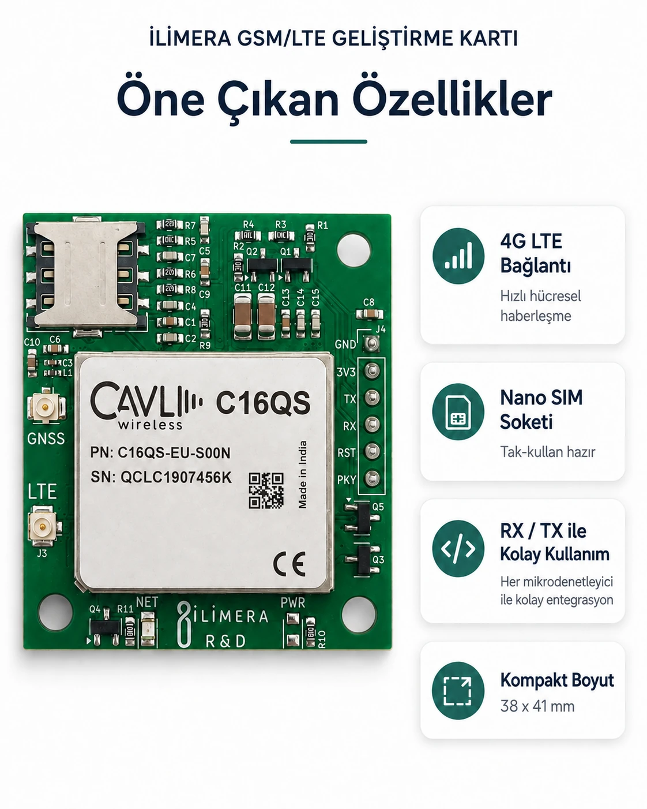
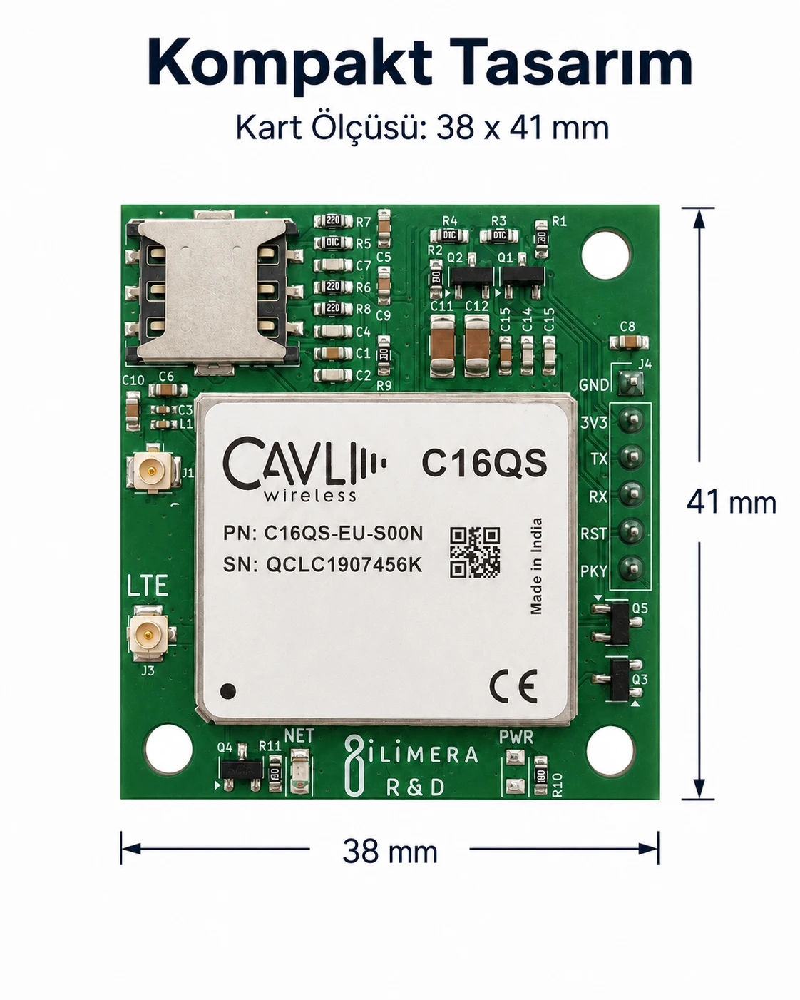
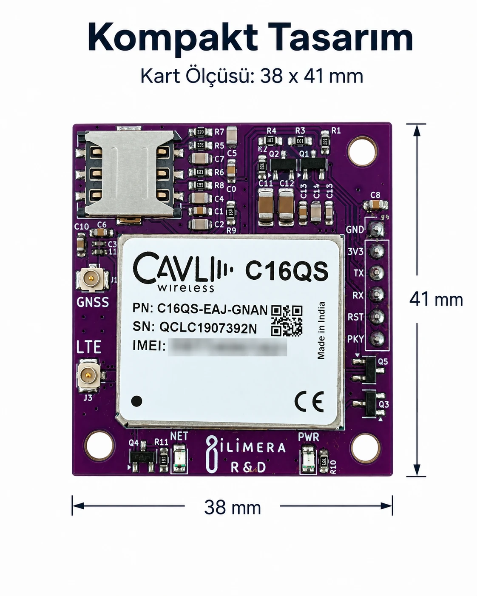
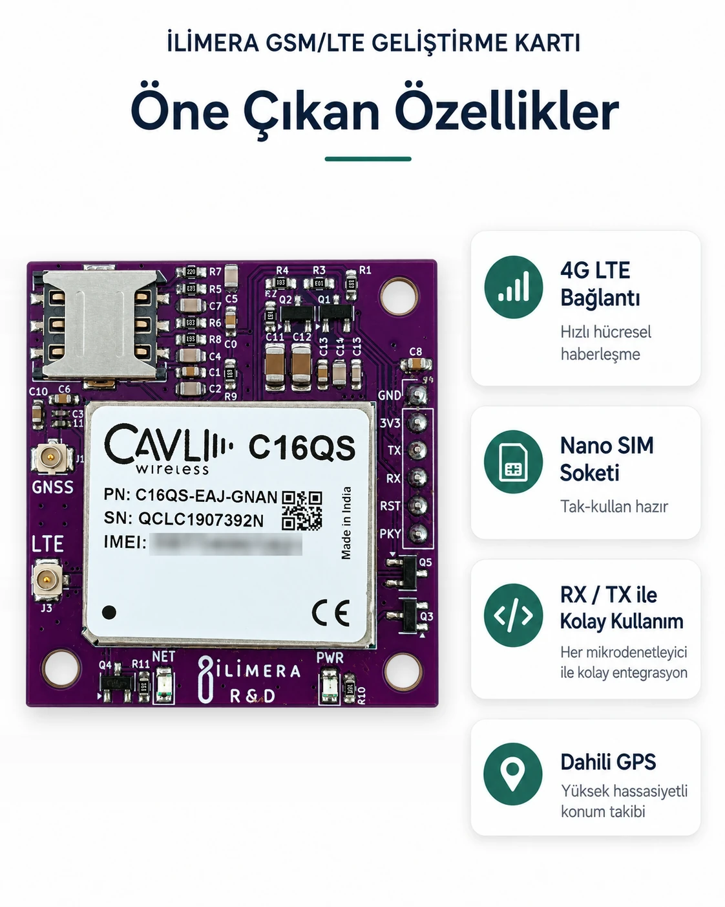

# CAVLI GSM/LTE Devboard

[English](README.en.md) · Ürün sayfaları: [CAVLI GSM/LTE Devboard](https://ilimera.com/urunler/gelistirme-kartlari/gsm-lte-devboard) ·
[CAVLI GSM/LTE Devboard Dahili GPS](https://ilimera.com/urunler/gelistirme-kartlari/gsm-lte-gps-devboard)



**Cavli C16QS** modülüyle 4G LTE (Cat 1.bis) hücresel bağlantıyı projenize UART üzerinden ekleyen, 38 × 41 mm
boyutunda bir geliştirme kartı. Nano SIM yuvası, LTE ve GNSS anten konnektörleri ile PWR/NET LED'leri kart
üzerinde hazırdır. STM32, ESP32, Arduino, PIC, nRF gibi 3.3 V lojikli her denetleyiciyle AT komutlarıyla
kullanılır.

Bu depo iki sürümün ortak deposudur:

| Sürüm | Fark | Teknik doküman |
| --- | --- | --- |
| **CAVLI GSM/LTE Devboard** | 4G LTE | [PDF](docs/CAVLI_GSMLTE_teknik_dokuman_v1.pdf) |
| **CAVLI GSM/LTE Devboard Dahili GPS** | 4G LTE + dahili GPS (GNSS) | [PDF](docs/CAVLI_GSMLTE_GPS_teknik_dokuman_v1.pdf) |

GPS örneği (`05_GPS_Konum_Okuma`) dışındaki her şey iki sürümde aynıdır.

## İçindekiler

- [Teknik özellikler](#teknik-özellikler)
- [Pinler ve bağlantı](#pinler-ve-bağlantı)
- [Güç ve lojik seviye](#güç-ve-lojik-seviye)
- [Hızlı başlangıç](#hızlı-başlangıç)
- [Örnekler](#örnekler)
- [AT komutları](docs/AT_KOMUTLARI.md)
- [Sık karşılaşılan sorunlar](#sık-karşılaşılan-sorunlar)

## Teknik özellikler

| Özellik | Değer |
| --- | --- |
| Hücresel modül | Cavli C16QS, 4G LTE Cat 1.bis |
| Konum | Dahili GPS (GNSS) — yalnız **Dahili GPS** sürümünde |
| Arayüz | UART (TX, RX), 115200 baud 8N1 (fabrika ayarı) |
| Kontrol pinleri | RST (aktif-düşük), PKY (Power Key) |
| Besleme | 3V3 ve GND; 3V3 hattı anlık en az **2 A** verebilmeli |
| Lojik seviye | 3.3 V (**5 V toleranslı değil**) |
| SIM | Nano SIM yuvası (kart üzerinde) |
| Anten | LTE (zorunlu) ve GNSS, U.FL/IPEX |
| Göstergeler | PWR, NET LED'leri |
| Boyut | 38 × 41 mm |

## Pinler ve bağlantı

| Kart pini | Yön | Bağlanacağı yer |
| --- | --- | --- |
| GND | — | Denetleyicinin GND'si (ortak toprak) |
| 3V3 | Giriş | Anlık 2 A verebilen 3.3 V regülatör |
| TX | Çıkış | Denetleyicinin **RX**'i |
| RX | Giriş | Denetleyicinin **TX**'i |
| PKY | Giriş | Bir GPIO: modemi açma/kapatma darbesi |
| RST | Giriş | (İsteğe bağlı) bir GPIO: aktif-düşük donanım resetı |

Örneklerde kullanılan ESP32 DevKit bağlantısı:

```text
CAVLI TX  → ESP32 GPIO16      CAVLI PKY → ESP32 GPIO4
CAVLI RX  ← ESP32 GPIO17      CAVLI GND → ESP32 GND
CAVLI 3V3 ← harici 3.3 V / 2 A regülatör  (ESP32 kartının 3V3 pini yetmez)
```

Pinleri her örneğin başındaki **KULLANICI AYARLARI** bölümünden değiştirebilirsiniz. Örneklerde açılışta modem
`AT`'ye cevap vermezse PKY pinine 500 ms'lik bir darbe gönderilir; modem açılmıyorsa `PKY_BASILI` ve
`PKY_SERBEST` değerlerini yer değiştirin.

## Güç ve lojik seviye

- **Besleme:** LTE veri aktarımı sırasında modem anlık yüksek akım çeker. 3V3 hattı en az **2 A** anlık akım
  verebilen kaliteli bir regülatörden gelmelidir; aksi hâlde modem şebekeden düşer ya da yeniden başlar.
- **3.3 V lojik:** TX, RX, RST ve PKY pinleri 5 V toleranslı **değildir**. Arduino Uno/Mega gibi 5 V
  denetleyicilerde TX/RX ve kontrol hatlarına mutlaka **lojik seviye dönüştürücü** ekleyin.
- **Anten:** Karta enerji vermeden önce LTE antenini takın. Konum için GNSS konnektörüne aktif bir GNSS anteni
  bağlayın.

## Hızlı başlangıç

1. Nano SIM'i takın, LTE antenini bağlayın, kartı denetleyicinize bağlayın (yukarıdaki tablo).
2. Arduino IDE'de ESP32 kart paketini kurun ve [`examples/01_AT_Komut_Terminali`](examples/01_AT_Komut_Terminali)
   örneğini yükleyin.
3. Seri Monitörü **115200 baud, Both NL & CR** ile açın ve sırasıyla deneyin:

```text
AT            → OK
AT^SIMSWAP?   → 1           (0 ise AT^SIMSWAP=1 gönderin: karttaki Nano SIM yuvası)
AT+CPIN?      → +CPIN: READY
AT+CSQ        → +CSQ: 24,99 (10 ve üzeri iyi)
AT+CEREG?     → +CEREG: 0,1 (şebekeye kayıtlı)
```

4. Ardından internete çıkmak için [`src/main.cpp`](src/main.cpp) (HTTP GET) ya da diğer örneklere geçin.

## Örnekler

| Örnek | Ne yapar |
| --- | --- |
| [`src/main.cpp`](src/main.cpp) | **AR-GE referans örneği** (PlatformIO, ESP32-C3): modemi açar, SIM ve şebekeyi bekler, APN ile veri bağlamını açar ve HTTP GET yapar |
| [01_AT_Komut_Terminali](examples/01_AT_Komut_Terminali) | Seri Monitörden modeme doğrudan AT komutu gönderin |
| [02_HTTP_POST_JSON](examples/02_HTTP_POST_JSON) | 60 saniyede bir sunucuya JSON gövdeli HTTP POST gönderir |
| [03_SMS_Gonder_ve_Al](examples/03_SMS_Gonder_ve_Al) | SMS gönderir; yetkili numaradan gelen SMS komutlarıyla bir çıkışı açar/kapatır |
| [04_MQTT_Yayinla_Abone_Ol](examples/04_MQTT_Yayinla_Abone_Ol) | Modemin dahili MQTT istemcisiyle telemetri yayınlar, komut konusunu dinler |
| [05_GPS_Konum_Okuma](examples/05_GPS_Konum_Okuma) | **Dahili GPS sürümü:** konum, hız ve UTC saatini okur, Google Haritalar bağlantısı verir |

`src/main.cpp` PlatformIO projesidir. `pio run -t upload` ile yüklenir. Pin tanımlarını (`MODEM_TX_PIN`,
`MODEM_RX_PIN`, `MODEM_PWRKEY_PIN`) kendi devrenize göre değiştirin. `examples/` altındaki çizimler Arduino
IDE'de doğrudan açılır, ek kütüphane gerektirmez. Kod 3.3 V'luk her denetleyiciye taşınabilir: değişen tek şey
seri port ve pin tanımlarıdır.

## Sık karşılaşılan sorunlar

| Belirti | Çözüm |
| --- | --- |
| `AT`'ye cevap yok | TX/RX'i çaprazlayın, GND'yi birleştirin, PKY darbesini kontrol edin, baud hızı 115200 olmalı |
| SIM görünmüyor (`+CPIN` hatası) | `AT^SIMSWAP=1` ile karttaki Nano SIM yuvasını seçin |
| `+CEREG: 0,2` uzun sürüyor | LTE antenini kontrol edin; bölgede 4G kapsaması olmalı |
| Veri gönderirken modem yeniden başlıyor | 3V3 kaynağı yetersiz: anlık 2 A veren bir regülatör kullanın |
| Arduino Uno ile çalışmıyor ya da kart ısınıyor | 5 V lojik! TX/RX'e seviye dönüştürücü ekleyin |
| `HTTPSEND: FAIL` | APN'i ve `AT+CGACT?` cevabını kontrol edin; HTTPS için sertifika gerekir |
| `AT+CGPS=1` → `ERROR` | GPS yalnız **Dahili GPS** sürümünde vardır; GNSS antenini kontrol edin |

Daha fazlası: [AT komut başvurusu](docs/AT_KOMUTLARI.md).

## Ölçüler

| CAVLI GSM/LTE Devboard | Dahili GPS sürümü |
| --- | --- |
|  |  |



## Kaynaklar ve destek

- Üretici belgeleri (C16QS AT Command Manual, Hardware Manual):
  [Cavli ürün ve çözüm kılavuzları](https://www.cavliwireless.com/resources/product-and-solution-guides)
- AT komutlarına genel giriş: [Cavli — An Introduction to Cellular AT Commands](https://www.cavliwireless.com/blog/nerdiest-of-things/an-introduction-to-cellular-at-commands)
- Teknik doküman, güncellemeler ve destek: [ilimera.com](https://ilimera.com/urunler/gelistirme-kartlari/gsm-lte-devboard)
- Hata bildirimi ve öneriler için bu depoda **Issue** açabilirsiniz.

AT komutu yazmadan HTTPS ile internete çıkmak isterseniz:
[İLİMERA LTE Bridge](https://ilimera.com/urunler/gelistirme-kartlari/lte-bridge) aynı modülü tek satır JSON ile kullanır.

CAVLI GSM/LTE Devboard, İLİMERA Teknoloji tarafından geliştirilmiştir. Cavli ve C16QS, Cavli Inc.'in ticari markalarıdır.

## Lisans

Örnek kodlar [MIT lisansı](LICENSE) ile sunulur; kendi ürünlerinizde serbestçe kullanabilirsiniz.
Teknik dokümanlar ve görseller İLİMERA Teknoloji'ye aittir.
